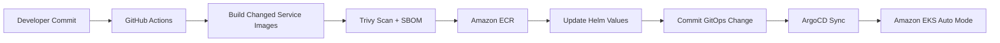
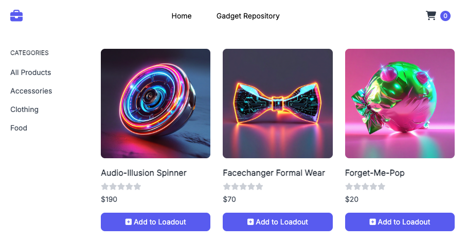
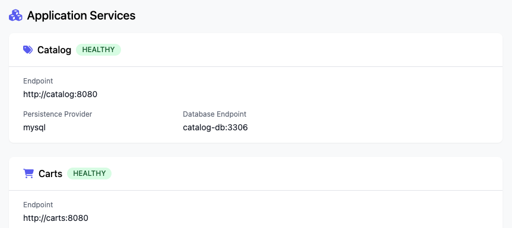
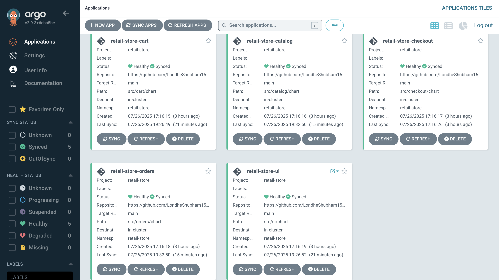
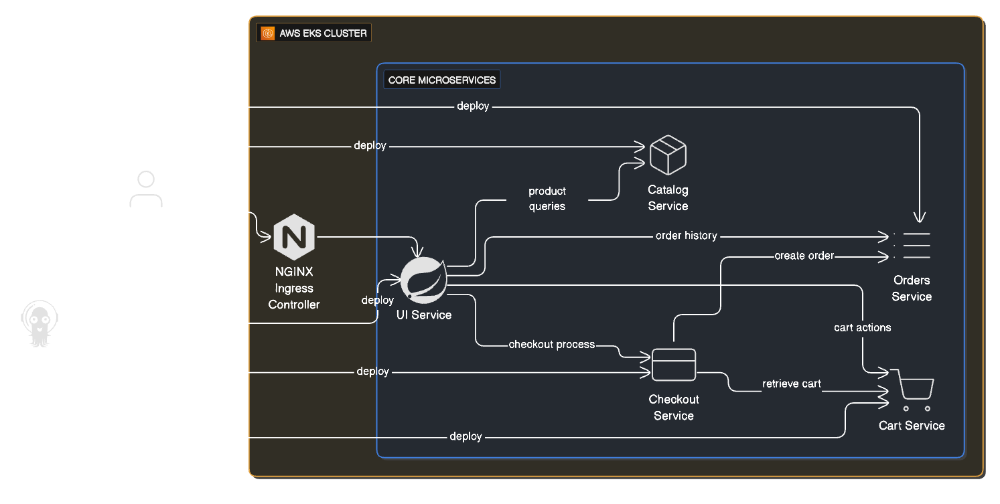
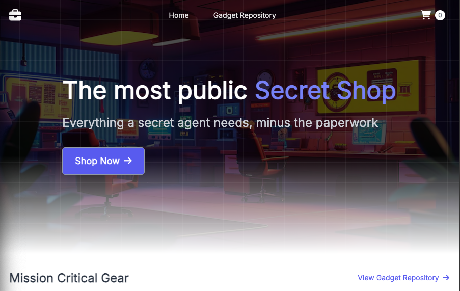
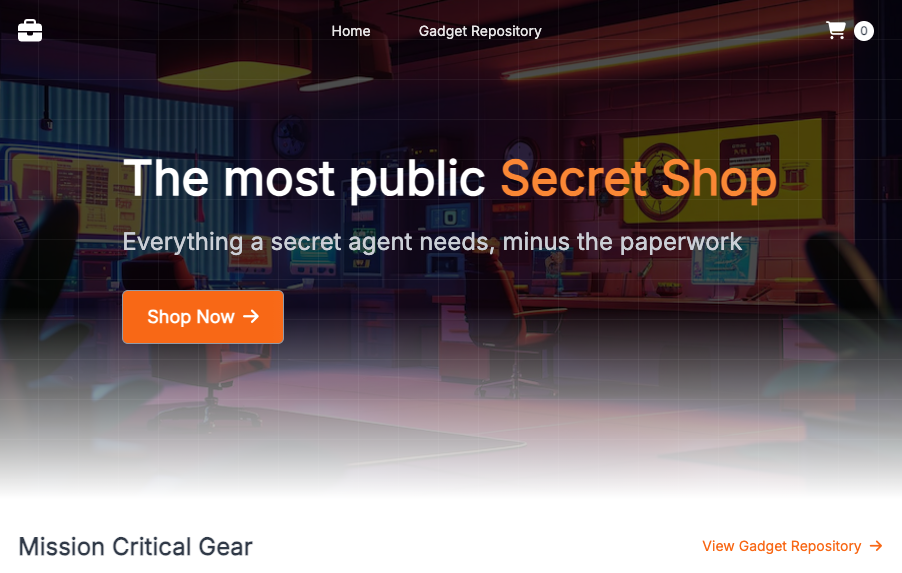
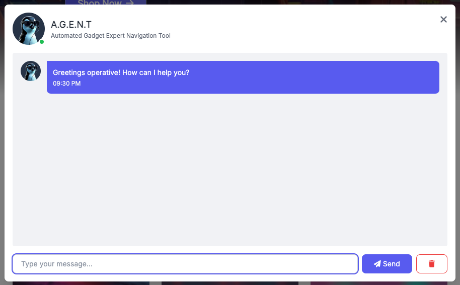

# Retail Store DevOps Platform on AWS EKS


<div align="center">


**Production-style retail microservices platform using AWS EKS Auto Mode, Terraform, Helm, ArgoCD GitOps, Amazon ECR, GitHub Actions OIDC, security scanning, SBOM generation, and operational runbooks.**

</div>

---

## Project Overview

This project deploys a complete retail store microservices application on AWS using a modern DevOps and GitOps workflow. The original recipe is preserved: multiple application services are containerized, packaged with Helm, deployed to Amazon EKS, and continuously reconciled through ArgoCD.

The project was upgraded for portfolio quality with safer CI/CD, OIDC-based AWS authentication, Trivy scanning, SBOM generation, CodeQL, dependency review, Terraform/Helm validation, drift detection, runbooks, and AI-ready release summary notes.

---

## Architecture

### Application Architecture

| Service | Language / Framework | Purpose | Helm Path |
|---|---|---|---|
| UI | Java / Spring Boot | Retail storefront web UI | `src/ui/chart` |
| Catalog | Go / Gin | Product catalog API | `src/catalog/chart` |
| Cart | Java / Spring Boot | Shopping cart API | `src/cart/chart` |
| Orders | Java / Spring Boot | Order management API | `src/orders/chart` |
| Checkout | Node.js / NestJS | Checkout orchestration API | `src/checkout/chart` |


### Platform Architecture




---

## What Was Upgraded

- Reworked README for a stronger GitHub portfolio presentation
- Added existing project snapshots directly into README
- Updated ArgoCD repository references for your GitHub portfolio repo
- Replaced long-lived AWS key workflow pattern with GitHub Actions OIDC role assumption
- Added changed-service build, image scan, SBOM, ECR push, and Helm value update workflow
- Added Terraform, Helm, YAML, Trivy, CodeQL, and dependency review workflows
- Added Terraform drift detection workflow
- Fixed checkout service Dockerfile ownership issue in the production image
- Added `EXPOSE 8080` to service Dockerfiles where missing
- Removed committed `.env` file and added `.env.example`
- Added stronger `.gitignore` for secrets, Terraform state, SBOM/scanner outputs, and build artifacts
- Added Terraform backend and tfvars examples
- Added Terraform variable validation improvements
- Removed perpetual Terraform tag drift caused by timestamp-based tag value
- Added `SECURITY.md`, `PORTFOLIO_NOTES.md`, `GITHUB_UPLOAD_STEPS.md`, architecture docs, runbook, screenshots guide, and GenAI enhancement notes

---

## Repository Structure

```text
.
├── .github/workflows/          # CI/CD, security, drift detection workflows
├── argocd/                     # ArgoCD project and application manifests
├── docs/                       # Architecture, runbook, screenshots, images
├── infra/                      # Terraform for VPC, EKS, add-ons, ArgoCD
├── scripts/                    # Optional release summary utilities
├── src/
│   ├── app/chart               # Umbrella Helm chart
│   ├── cart                    # Java cart service
│   ├── catalog                 # Go catalog service
│   ├── checkout                # Node.js checkout service
│   ├── orders                  # Java orders service
│   └── ui                      # Java UI service
├── README.md
├── SECURITY.md
└── PORTFOLIO_NOTES.md
```

---

## Prerequisites

| Tool | Recommended Version |
|---|---|
| AWS CLI | v2+ |
| Terraform | 1.6+ |
| kubectl | Compatible with your EKS version |
| Helm | 3.x |
| Docker | 24+ |
| Git | 2.x |

---

## Setup and Deployment

### 1. Clone the repository

```bash
git clone https://github.com/yugandhar99/retail-store-devops-platform.git
cd retail-store-devops-platform
```

### 2. Configure AWS locally

```bash
aws sts get-caller-identity
aws configure get region
```

### 3. Review Terraform variables

```bash
cd infra
cp terraform.tfvars.example terraform.tfvars
```

Edit values such as AWS region, cluster name, environment, and monitoring preference.

### 4. Deploy infrastructure

```bash
terraform init
terraform fmt -recursive
terraform validate
terraform plan
terraform apply
```

### 5. Configure kubectl

```bash
aws eks update-kubeconfig --region us-west-2 --name $(terraform output -raw cluster_name)
kubectl get nodes
```

### 6. Check ArgoCD

```bash
kubectl get applications -n argocd
kubectl get pods -n argocd
```

---

## GitHub Actions Setup

Create one GitHub repository variable:

| Variable | Example |
|---|---|
| `AWS_REGION` | `us-west-2` |

Create one GitHub secret:

| Secret | Purpose |
|---|---|
| `AWS_ROLE_TO_ASSUME` | IAM role ARN used by GitHub Actions OIDC |

The workflow avoids storing long-lived AWS access keys in GitHub.

---

## GitOps Deployment Flow

1. Developer changes one or more services under `src/`.
2. GitHub Actions detects which service changed.
3. Only changed service images are built.
4. Trivy scans images and generates SARIF/SBOM artifacts.
5. Images are pushed to Amazon ECR.
6. Helm `values.yaml` image tags are updated.
7. GitHub Actions commits the GitOps change to `main`.
8. ArgoCD syncs the updated Helm chart into EKS.

---

## Project Snapshots

### Retail Store UI



### Application Topology



### Container View


### ArgoCD Dashboard



### Application Architecture



### UI Theme Examples





### Chat Bot UI Snapshot



---

## Useful Operations Commands

```bash
kubectl get pods -n retail-store
kubectl get svc -n retail-store
kubectl get ingress -n retail-store
kubectl get applications -n argocd
```

```bash
kubectl logs -n retail-store deployment/ui --tail=100
kubectl logs -n retail-store deployment/catalog --tail=100
kubectl describe application retail-store-ui -n argocd
```

More details are available in [docs/RUNBOOK.md](./docs/RUNBOOK.md).

---

## Cleanup

```bash
cd infra
terraform destroy
```

Also remove any manually created ECR repositories if they are no longer required:

```bash
aws ecr delete-repository --repository-name retail-store-ui --force
aws ecr delete-repository --repository-name retail-store-catalog --force
aws ecr delete-repository --repository-name retail-store-cart --force
aws ecr delete-repository --repository-name retail-store-checkout --force
aws ecr delete-repository --repository-name retail-store-orders --force
```

---

## Security Notes

- Do not commit AWS keys, `.env` files, kubeconfig files, Terraform state files, or real production variables.
- Use GitHub Actions OIDC and IAM roles for CI/CD access to AWS.
- Store Terraform state in a secure remote backend such as S3 with encryption and locking.
- Review Trivy, CodeQL, Dependency Review, and SBOM outputs before production rollout.

---

## Attribution

This portfolio project is based on the AWS Containers Retail Sample App concept and was upgraded as a DevOps/GitOps platform project for hands-on learning. Original attribution files inside each service are preserved.

---

## License

This project keeps the original license structure. See [LICENSE](./LICENSE) and service-level attribution files for details.


---

<p align="center">
  
</p>

<h2 align="center">🤝 Connect With Me</h2>

<p align="center">
  <em>
    Thanks for visiting this project! I’m continuously building hands-on DevOps, Cloud, Automation, and AI-enabled engineering projects to improve real-world deployment, monitoring, and infrastructure skills.
  </em>
</p>

<p align="center">
  
</p>

<p align="center">
  <a href="https://github.com/yugandhar99" target="_blank" rel="noopener noreferrer">
    
  </a>
  <a href="https://www.linkedin.com/in/yugandhar-devops" target="_blank" rel="noopener noreferrer">
    
  </a>
  <a href="https://yugandhar-portfolio-psi.vercel.app/" target="_blank" rel="noopener noreferrer">
    
  </a>
  <a href="mailto:yugandharethamukkala1999@gmail.com">
    
  </a>
</p>

<p align="center">
  
  
  
  
</p>

---

<p align="center">
  ⭐ If this project added value, feel free to star the repository and connect with me!
</p>

<p align="center">
  <strong>Built with ❤️ using modern DevOps practices</strong>
</p>

