# Architecture

This project demonstrates a production-style retail microservices platform on AWS.

## Application layer

- **UI**: Java/Spring Boot web frontend
- **Catalog**: Go API backed by MySQL-compatible storage in the chart
- **Cart**: Java/Spring Boot API backed by DynamoDB Local for local/chart testing
- **Orders**: Java/Spring Boot API using PostgreSQL and RabbitMQ components in the chart
- **Checkout**: Node.js/NestJS orchestration API using Redis and downstream service calls

## Platform layer

- **Amazon EKS Auto Mode** for simplified Kubernetes compute management
- **Terraform** for VPC, EKS, add-ons, and ArgoCD bootstrap
- **Helm** for service packaging
- **ArgoCD** for GitOps reconciliation
- **Amazon ECR** for private container image storage
- **GitHub Actions** for changed-service build, image scanning, SBOM generation, image push, and Helm value updates

## Deployment flow

```mermaid
graph LR
  Dev[Developer Push] --> GA[GitHub Actions]
  GA --> Detect[Detect Changed Services]
  Detect --> Build[Build Docker Images]
  Build --> Scan[Trivy Scan + SBOM]
  Scan --> ECR[Push to Amazon ECR]
  ECR --> Helm[Update Helm values]
  Helm --> Git[Commit GitOps Change]
  Git --> Argo[ArgoCD Sync]
  Argo --> EKS[Deploy to EKS]
```

## Security model

- GitHub Actions uses AWS OIDC role assumption instead of static AWS keys.
- Container images are scanned before push.
- SBOM artifacts are generated for release traceability.
- Terraform state files are intentionally excluded from Git.
- Private ECR repositories use scan-on-push and encryption.
